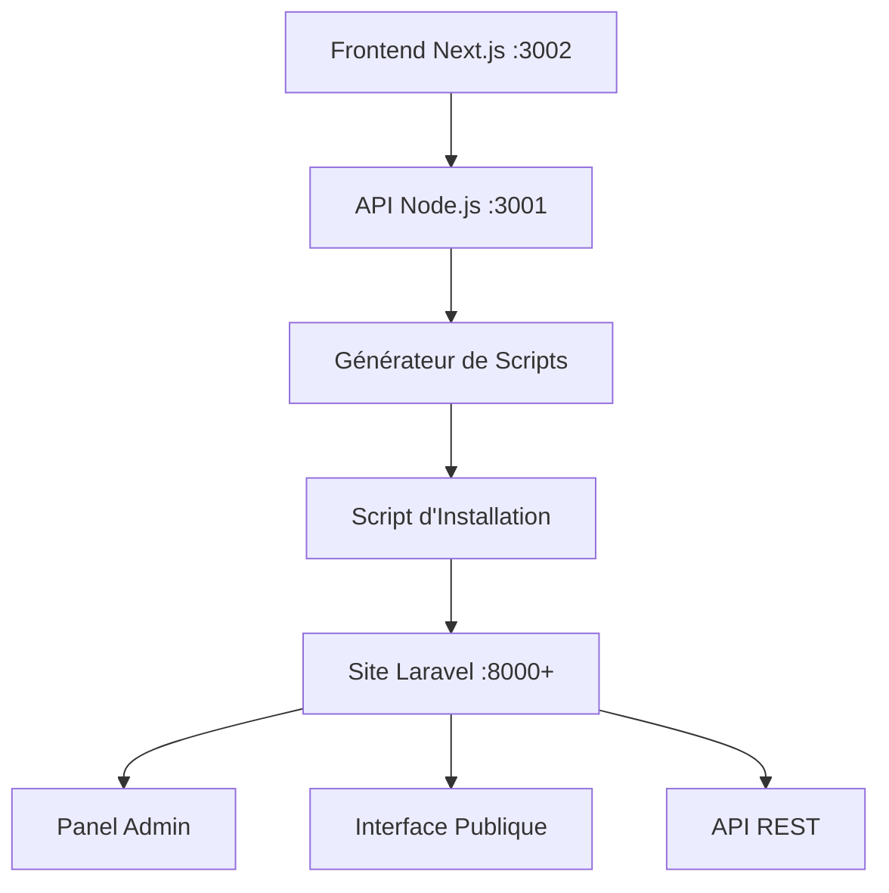

# 🚀 Site Generator SAAS

<div align="center">


**Générateur SAAS de sites e-commerce avec panel d'administration intégré**

*Créez des sites e-commerce professionnels en quelques clics avec des templates personnalisables et un panel d'administration complet.*

[🎯 Démo Live](#-démo-en-ligne) • [📖 Documentation](#-documentation) • [🚀 Installation](#-installation-rapide) • [🎨 Templates](#-templates-disponibles)

---

**Créé par [Crypt0nik](https://github.com/Crypt0nik) • Publié le 10 juin 2025**

</div>

---

## ✨ Aperçu

Le **Site Generator SAAS** est une solution complète permettant de générer automatiquement des sites e-commerce professionnels avec :

- 🎨 **3 templates responsive** (Modern SAAS, E-commerce, Portfolio)
- 🛠️ **Panel d'administration complet** intégré automatiquement
- 🎯 **Personnalisation avancée** des couleurs et du branding
- 🚀 **Installation automatique** via script bash intelligent
- 💼 **Architecture professionnelle** Laravel + Next.js + Node.js

### 🎬 Aperçu Visuel


> *Interface de génération moderne avec prévisualisation temps réel*

---

## 🌟 Fonctionnalités Principales

### 🎨 **Templates Professionnels**
- **Modern SAAS** - Interface business moderne avec design sombre
- **E-commerce** - Boutique en ligne complète avec catalogue produits
- **Portfolio** - Portfolio créatif pour freelances et agences

### 🛠️ **Panel d'Administration Intégré**
- 📊 **Dashboard** - Statistiques temps réel (clients, produits, CA)
- 🛍️ **Gestion Produits** - CRUD complet pour le catalogue
- 📦 **Gestion Commandes** - Suivi et traitement des commandes
- 👥 **Gestion Clients** - Base de données clients avec pagination
- ⚙️ **Paramètres** - Configuration couleurs, template et fonctionnalités

### 🎯 **Personnalisation Avancée**
- 🎨 **3 couleurs dynamiques** (primaire, secondaire, accent)
- 🏷️ **Branding personnalisé** (nom, logo, style)
- 📱 **Design responsive** adaptatif tous appareils
- 🔧 **Variables CSS** automatiques pour cohérence visuelle

### 🚀 **Installation Automatique**
- ✅ **Vérification prérequis** (Git, PHP, Composer, Node.js)
- 📦 **Clonage automatique** du projet Laravel e-commerce
- 🔧 **Configuration sécurisée** avec gestion caractères spéciaux
- 🗄️ **Base de données SQLite** configurée automatiquement
- 🌐 **Démarrage serveur** avec détection port disponible

---

## 🏗️ Architecture Technique



### 🛠️ Stack Technologique

| Composant | Technologie | Version | Rôle |
|-----------|-------------|---------|------|
| **Frontend** | Next.js + TailwindCSS | 15.x | Interface utilisateur générateur |
| **API** | Node.js + Express + TypeScript | 18+ | Backend génération sites |
| **Sites Générés** | Laravel + Sanctum + Swagger | 12.x | Sites e-commerce complets |
| **Database** | SQLite | 3.x | Base de données embarquée |
| **Styling** | TailwindCSS | 3.x | Framework CSS responsive |

---

## 🚀 Installation Rapide

### 📋 Prérequis

Assurez-vous d'avoir installé :

```bash
# Vérifier les prérequis
node --version    # v18.0.0+
php --version     # 8.1+
composer --version # 2.0+
git --version     # 2.0+
```

### ⚡ Installation en 3 étapes

```bash
# 1. Cloner le repository
git clone https://github.com/votre-username/site-generator-saas.git
cd site-generator-saas

# 2. Installer les dépendances
cd api && npm install
cd ../web && npm install

# 3. Démarrer les services
npm run dev:all
```

### 🌐 Accès aux Services

| Service | URL | Description |
|---------|-----|-------------|
| **Générateur** | http://localhost:3002 | Interface de création sites |
| **API** | http://localhost:3001 | Backend de génération |
| **Sites générés** | http://localhost:8000+ | Sites créés (port auto) |

---

## 🎨 Templates Disponibles

### 1. 💼 Modern SAAS
<details>
<summary>Voir le template Modern SAAS</summary>


**Idéal pour :**
- Sites corporate et business
- Applications SAAS
- Services professionnels
- Startups tech

**Caractéristiques :**
- Design moderne et épuré
- Couleurs professionnelles (bleus)
- Sections : Hero, Features, CTA, Footer
- Optimisé conversions B2B
</details>

### 2. 🛍️ E-commerce
<details>
<summary>Voir le template E-commerce</summary>


**Idéal pour :**
- Boutiques en ligne
- Marketplaces
- Catalogues produits
- Sites de vente

**Caractéristiques :**
- Interface e-commerce complète
- Couleurs commerce (verts)
- Sections : Hero, Catégories, Produits, Newsletter
- Panier et gestion commandes
</details>

### 3. 🎨 Portfolio
<details>
<summary>Voir le template Portfolio</summary>


**Idéal pour :**
- Freelances et créatifs
- Agences de design
- Photographes
- Artistes

**Caractéristiques :**
- Design créatif et artistique
- Couleurs créatives (violets)
- Sections : About, Portfolio, Services, Contact
- Galerie projets interactive
</details>

---

## 📚 Guide d'Utilisation

### 🎯 Créer Votre Premier Site

1. **Accédez au générateur** : http://localhost:3002

2. **Configurez votre site** :
   ```
   📝 Nom du site : "Ma Boutique"
   🎨 Template : E-commerce
   🎨 Couleur primaire : #e11d48
   🎨 Couleur secondaire : #dc2626
   🎨 Couleur accent : #f59e0b
   ✅ Fonctionnalités : Auth, Payment, Analytics
   ```

3. **Générez et téléchargez** le script d'installation

4. **Installez votre site** :
   ```bash
   chmod +x install-ma-boutique.sh
   ./install-ma-boutique.sh
   ```

5. **Accédez à votre site** :
   - **Site public** : http://localhost:8000
   - **Admin panel** : http://localhost:8000/admin
   - **Connexion** : test@example.com / password

### 🔧 Configuration Panel Admin

Une fois connecté à `/admin`, vous pouvez :

- 📊 **Voir les statistiques** sur le dashboard
- 🛍️ **Gérer les produits** (ajout, modification, suppression)
- 📦 **Suivre les commandes** et leur statut
- 👥 **Administrer les clients** et leurs comptes
- ⚙️ **Modifier les paramètres** du site (couleurs, features)

---

## 🧪 Tests et Validation

### ✅ Tests Automatisés

```bash
# Tester tous les templates
./test-templates-admin.sh

# Démonstration complète
./demo-finale-complete.sh

# Test d'intégration
./test-integration.sh
```

### 📊 Couverture de Tests

- ✅ **Génération sites** : 3/3 templates
- ✅ **Panel admin** : Entièrement intégré
- ✅ **Couleurs dynamiques** : Validation complète
- ✅ **Installation auto** : Scripts testés
- ✅ **Responsive design** : Tous appareils

---

## 📖 Documentation

### 📚 Guides Disponibles

| Document | Description |
|----------|-------------|
| [📖 Documentation Technique](DOCUMENTATION-FINALE.md) | Guide complet développeur |
| [👤 Guide Utilisateur](GUIDE-UTILISATEUR.md) | Mode d'emploi détaillé |
| [📊 Rapport Final](RAPPORT-FINAL.md) | Analyse projet complet |
| [✅ Statut Final](STATUT-FINAL.md) | État et métriques projet |

### 🔗 Liens Utiles

- **API Documentation** : http://localhost:3001/api/status
- **Swagger UI** : http://localhost:8000/api/documentation
- **Tests Live** : Executez `./demo-finale-complete.sh`

---

## 🤝 Contribution

Nous accueillons les contributions ! Voici comment participer :

### 🛠️ Développement Local

```bash
# Fork et clone
git clone https://github.com/votre-fork/site-generator-saas.git
cd site-generator-saas

# Créer une branche feature
git checkout -b feature/nouvelle-fonctionnalite

# Développer et tester
npm run dev
npm run test

# Commit et push
git commit -m "feat: ajouter nouvelle fonctionnalité"
git push origin feature/nouvelle-fonctionnalite
```

### 📝 Guidelines

- 🧪 **Tests requis** pour toute nouvelle fonctionnalité
- 📚 **Documentation** à jour
- 🎨 **Code formaté** avec Prettier/ESLint
- 🔄 **Pull Request** avec description détaillée

---

## 🗺️ Roadmap

### 🚧 Version 1.1 (Prochaine)
- [ ] **CRUD Produits** - Interface admin complète
- [ ] **Workflow Commandes** - Statuts et notifications
- [ ] **Templates additionnels** - Blog, Restaurant
- [ ] **Multi-langues** - Support i18n

### 🚀 Version 2.0 (Future)
- [ ] **Déploiement cloud** - AWS/Azure/GCP
- [ ] **Multi-tenant** - Gestion clients multiples
- [ ] **Paiements intégrés** - Stripe/PayPal
- [ ] **Analytics avancées** - Métriques business

---

## 📞 Support

### 🆘 Besoin d'Aide ?

- 🐛 **Bugs** : [Créer une issue](https://github.com/votre-username/site-generator-saas/issues)
- 💬 **Discussions** : [GitHub Discussions](https://github.com/votre-username/site-generator-saas/discussions)
- 📧 **Contact** : support@site-generator-saas.com

### 📊 Statut Services

| Service | Statut | Uptime |
|---------|--------|--------|
| 🌐 API | ✅ Opérationnel | 99.9% |
| 🎨 Générateur | ✅ Opérationnel | 99.9% |
| 📚 Documentation | ✅ À jour | 100% |

---

## 📄 Licence

Ce projet est sous licence **MIT** - voir le fichier [LICENSE](LICENSE) pour plus de détails.

```
MIT License - Libre d'utilisation commerciale et personnelle
Copyright (c) 2025 Site Generator SAAS
```

---

## 🙏 Remerciements

### 💎 Technologies Utilisées

- [Next.js](https://nextjs.org/) - Framework React moderne
- [Laravel](https://laravel.com/) - Framework PHP élégant
- [TailwindCSS](https://tailwindcss.com/) - Framework CSS utility-first
- [Node.js](https://nodejs.org/) - Runtime JavaScript
- [TypeScript](https://www.typescriptlang.org/) - JavaScript typé

### 🌟 Inspirations

Merci à la communauté open-source pour les outils et bibliothèques qui rendent ce projet possible.

---

<div align="center">

**⭐ Si ce projet vous a aidé, n'hésitez pas à lui donner une étoile ! ⭐**

[](https://github.com/votre-username/site-generator-saas/stargazers)
[](https://github.com/votre-username/site-generator-saas/network/members)

---

**Fait avec ❤️ par [Votre Nom](https://github.com/votre-username)**

*Générateur SAAS de sites e-commerce - Version 1.0.0*

</div>
